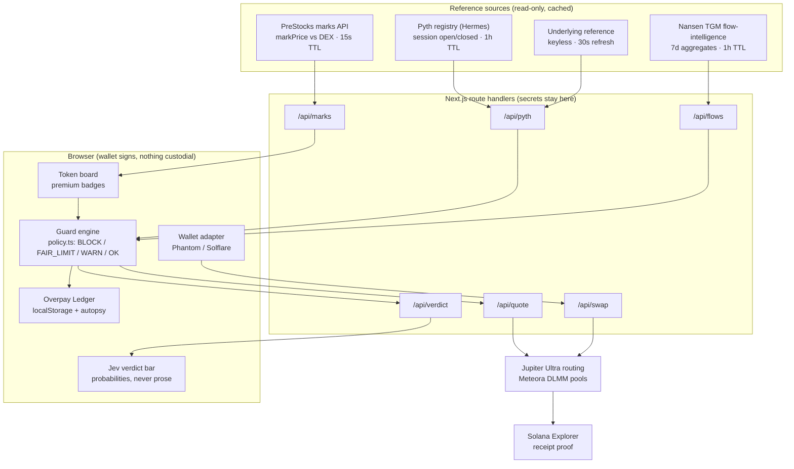

# FairBuy — never overpay for stocks on Solana

**Live demo:** https://fairbuy-stocklana.fly.dev/ ·
**Repo:** https://github.com/PhiBao/fairbuy ·
**Hackathon:** Stocklana — Main track + PreStocks bounty · submissions close Sep 25 2026, 4pm ET

> The stock market went 24/7 onchain. Brokerage guardrails didn't come with it.
> FairBuy is the missing execution-safety layer: a fair reference beside every quote,
> a policy engine that **blocks** overpaying fills, and a ledger that learns your patterns.

---

## 1. Thesis

### What

FairBuy stands between your click and the loss. For every tokenized stock it shows three
numbers — **DEX price, fair reference, premium** — and enforces an execution policy on top:
hard-block absurd fills, require limits for elevated ones, TWAP thin books, and log everything
(including the blocks) to a personal Overpay Ledger that tightens your rules as it learns.

### Why

Onchain equities removed the broker's protections but kept the broker's prices as an illusion:

- **Invisible overpayment.** The OPENAI pre-IPO token traded at **+53% above its issuer mark**
  (verified live). A $1,000 market-buy overpaid ~$350. No wallet, aggregator, or chart showed it.
- **Off-hours dislocation.** 63–68% of Solana equity volume prints while the underlying market
  is closed. Stale quotes, wide spreads, thin books — and nothing stops the click.
- **No brokerage primitives.** No limit/stop discipline, no DCA-at-fair, no corporate-action
  awareness. DeFi gave us 24/7 access and zero safety.
- **Sharp vs crowd blindness.** While fresh wallets piled +$10M into NVDAx in a week, top-PnL
  wallets distributed −$905k into them (Nansen TGM, verified). Retail never sees the other side
  of its own trade.

Existing products are dashboards (they *display* prices) or swap boxes (they *execute* blindly).
Nobody **enforces** at execution time. That enforcement gap is the product.

### How

1. **Reference layer** — PreStocks issuer marks (pre-IPO) + underlying reference with Pyth
   registry session state (listed). Every reference carries a freshness flag; stale reference =
   market-buy disabled, no exceptions.
2. **Policy engine (deterministic code, never prompts)** — premium vs your band, quote impact,
   on/off-chain divergence → `BLOCK / FAIR_LIMIT / WARN / OK`. The block lives in the policy
   function, so it can't be talked out of.
3. **Guarded execution** — Jupiter-routed fills you sign yourself (no custody), Fair-Limit
   conditional fills, TWAP-at-fair with per-slice re-checks.
4. **Typed machine judgment** — TypeSafe Jev returns calibrated `Choice + chase-risk + entry
   quality` over the same state the policy used. Deterministic verdict renders first; Jev
   enhances; any failure degrades to deterministic with an "offline" tag.
5. **Memory** — the Overpay Ledger records every attempt with regime context, runs a
   deterministic autopsy ("you overpay 75% of the time off-hours"), and offers one-click
   band tightening. The loop that turns one saved trade into permanently better rules.

---

## 2. Architecture



**Data flow for one guarded buy:** board badge → GuardCard pulls quote + verdict in parallel →
policy decides → user signs via wallet-adapter → Jupiter swap tx → confirmed signature →
Explorer link + ledger entry (fills *and* blocks).

**Key design decisions:**

- **No custom program.** Zero audit surface, zero upgrade keys, deterministic demo. We compose
  existing programs (Jupiter routing, Meteora pools, SPL tokens) instead of deploying new ones.
- **Policy owns the decision; models advise.** The deterministic verdict always renders; Jev
  only shifts displayed probabilities. A model outage can never unblock a bad fill.
- **Stale data fails closed.** Cached marks disable market-buys; missing flows degrade the card,
  never the guard.
- **Nansen ToS compliance by construction.** Only redistribution-allowed TGM aggregate
  endpoints, server-side cached, transformed into divergence readouts ("sharp vs crowd") —
  never wallet lists, never raw trades. "Flows by Nansen API" attributed in-product.

---

## 3. Why Solana

This product cannot exist anywhere else right now:

- **Tokenized-stock liquidity lives here.** ~85–95% of global onchain equity volume is on
  Solana (xStocks $1.6B/30d, 850k holders ATH; PreStocks $293M/30d). The problem we solve is
  physically located on this chain.
- **24/7 secondary + 24/5 issuance** creates the exact off-hours gap our session-aware guard
  prices in. A chain that halted with NYSE wouldn't need us.
- **Composability is the implementation.** One client flow fuses PreStocks marks, Jupiter
  routing, Meteora depth, and Nansen aggregates — four protocols, zero partnerships, sub-second
  quotes, sub-cent fees. TWAP-at-fair with per-slice re-checks is only economical at Solana
  fee levels.
- **Wallet-native distribution.** Phantom/Solflare adapter means the guard rides inside the
  user's existing flow — no new account, no custody handoff, no KYC delta.

---

## 4. Tech stack

| Layer | Choice | Why |
|---|---|---|
| App | Next.js 16 (App Router) + React 19 + TypeScript 5 + Tailwind 4, pnpm | Server routes hold secrets; client stays thin |
| Chain reads | `@solana/web3.js` 1.x (latest 1.x; v2 migration deferred — no API need) + wallet-adapter | Signing + confirmation; `skipPreflight:false` |
| Execution | Jupiter Ultra quote/swap APIs (keyless) | Best-route fills across Meteora DLMM pools |
| Pre-IPO reference | PreStocks REST (`/api/prestocks`), 15s TTL, pinned-snapshot fallback | The only public fair mark for pre-IPO tokens |
| Session truth | Pyth Hermes registry (`market_hours`), 1h TTL | Drives off-hours vs stale logic |
| Flow intel | Nansen TGM `flow-intelligence`, 7d, 1h TTL (~1 credit/token/hour) | Sharp-vs-crowd divergence |
| Machine judgment | TypeSafe System One (`jev-latest`), 6s timeout, server-side only | Typed Choice/Noul verdicts, graceful offline |
| Deploy | Fly.io (public URL) + Vercel (backup) · GitHub public | Docker standalone; secrets as platform envs, never in repo |

**Program/API IDs:** USDC `EPjFWdd5AufqSSqeM2qN1xzybapC8G4wEGGkZwyTDt1v` ·
NVDAx `Xsc9qvGR1efVDFGLrVsmkzv3qi45LTBjeUKSPmx9qEh` ·
PreStocks mints in `src/lib/tokens.ts` · Pyth NVDA feed `b1073854ed24…`.

---

## 5. Demo script (180 seconds)

| Time | Beat |
|---|---|
| 0:00 | Hook: "This $1,000 OPENAI buy overpays $350 and no wallet tells you." |
| 0:20 | Problem, live: mark vs DEX side-by-side, +53% badge. |
| 0:45 | First interaction: tap OPENAI, premium + verdict probabilities render. |
| 1:15 | **Wow: hit Market Buy → BLOCKED**, receipt shows the math and the save. |
| 1:45 | Technical proof: Fair-Limit set from mark band → Phantom sign → Explorer link, live. |
| 2:15 | Second proof: NVDAx sharp-vs-crowd (top-PnL −$905k into +$10M fresh) + TWAP-at-fair. |
| 2:40 | Differentiation: "Dashboards show charts. We stand between your click and the loss." + ledger autopsy. |
| 3:00 | Payoff: saved-$ receipt. "Every onchain broker needs this layer." |

Deterministic backstops: pinned tickers (OPENAI overpay / SPACEX discount / KALSHI fair),
cached-mode banner, rehearsed reject-path. Nothing in the demo depends on luck.

---

## 6. GTM plan

1. **Win the judging moment, then the timeline.** Submission + build thread on X during judging
   week (judges check iteration). Saved-$ receipts are natively shareable — every block is
   a screenshot that markets itself.
2. **PreStocks ecosystem page.** Their bounty explicitly routes continued projects to ecosystem
   listing + dedicated support + social amplification. That page *is* distribution to 100k+
   pre-IPO holders.
3. **Wallet/aggregator integration, not destination app.** The guard is a component: Jupiter,
   Phantom, and brokerage-style frontends all need a "fairness check" at execution. SDK-ify the
   policy engine (`premiumBps` + `evaluatePolicy` are already pure functions) and pitch it as
   an embed.
4. **Alert/DCA retention loop.** Premium-drop alerts and DCA-at-fair plans turn a one-time demo
   into weekly active use; ledger history is the switching cost.
5. **Monetization (post-hackathon):** freemium guard (free blocks, paid TWAP sizes/alerts) +
   B2B execution-quality API for brokers (per-checked-trade pricing). No token — nothing in the
   design needs one.

## 7. Roadmap / vision

- **Now (MVP):** pre-IPO guard + NVDAx listed leg + ledger + alerts + TWAP. Submitted.
- **Next:** more xStock majors, Jupiter limit-order backend for true resting Fair-Limits,
  corporate-action feed (splits, xStocks multiplier events, delistings), CSV → tax-report v1.
- **Then:** hedge-in-one-click (inverse-token pairing), recurring buys, spend-from-portfolio.
- **Vision:** the execution-quality layer for every onchain equity flow — the thing that makes
  "better than today's brokerage app" literally true: same assets, 24/7 access, *and* a guard
  that never sleeps. FairBuy becomes the reason a normie can hold stocks on Solana without
  getting quietly taxed by premiums and thin books.

## 8. Non-goals (deliberate)

No custom Anchor program · no Tessera/Clawpump in-submission (PreStocks exclusivity rule) ·
no true onchain resting limit orders (Fair-Limit = re-checked conditional fill) · no raw Nansen
Smart Money display (ToS-prohibited) · no options/shorts engine · no native mobile app ·
no token · no Pyth Pro dependency (verified: trial key lacks price scope; registry session
data carries the integration).

## 9. Run it

```bash
pnpm install
cp .env.local.example .env.local   # NANSEN_API_KEY, TYPESAFE_API_KEY (server-only)
pnpm dev                            # http://localhost:3000
```

`NEXT_PUBLIC_RPC_URL` optional (defaults to mainnet-beta). No private key is ever needed —
signing happens in your browser wallet.

## 10. Security model

No custody (user signs; `skipPreflight:false`) · 50bps slippage cap · marks labeled
issuer-reference, never oracle · stale-reference hard block · fee-aware Jupiter routing ·
secrets server-side only, never in repo (verified via `git ls-files`) · `pnpm audit` reviewed
at ship (transitive SDK findings only, none in request paths; unused native builds disabled via
`allowBuilds:false`) · no program = no upgrade keys to lose.

## 11. Remaining risks

Mark trust (mitigated: labeled reference + depth as second signal) · thin-pool slippage
(impact gate + TWAP) · Yahoo underlying latency (registry session is the authoritative switch) ·
RPC rate limits (override via env) · Nansen cache staleness (labeled "~1h delayed, never blocks").
